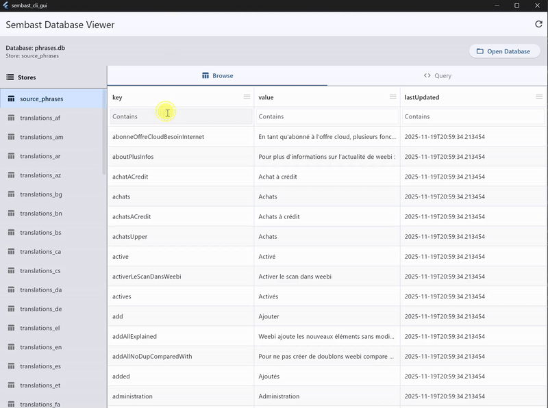

# Sembast CLI GUI

A Flutter app for viewing and querying a [Sembast database](https://github.com/tekartik/sembast.dart) using [PlutoGrid](https://pub.dev/packages/pluto_grid) for data grid display.



## Requirements

- Flutter SDK (>=3.24.0)
- Dart SDK (>=3.7.2)

## Running
### Windows

```bash
flutter run -d windows
```

## Features

### Frozen Columns
The first column (`_key`) is frozen by default, staying visible while scrolling horizontally.

### Column Filtering
Use the filter icons in column headers to filter data.

### Store Management
- Open any Sembast database file
- Select stores to view
- Add custom store names

### Simple queries
- Query execution with dart_eval


